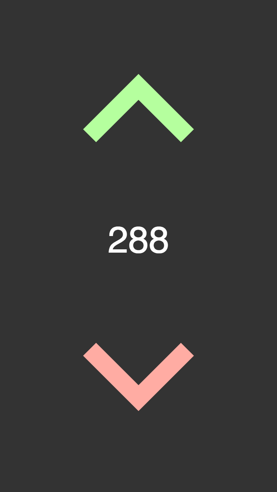
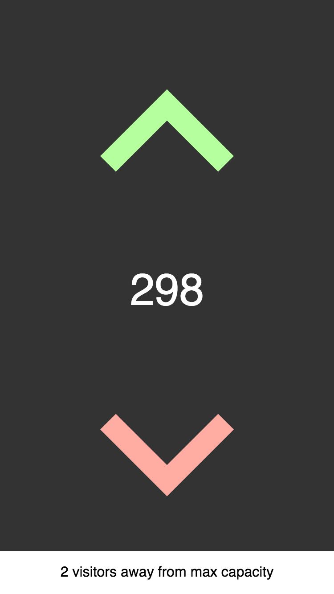
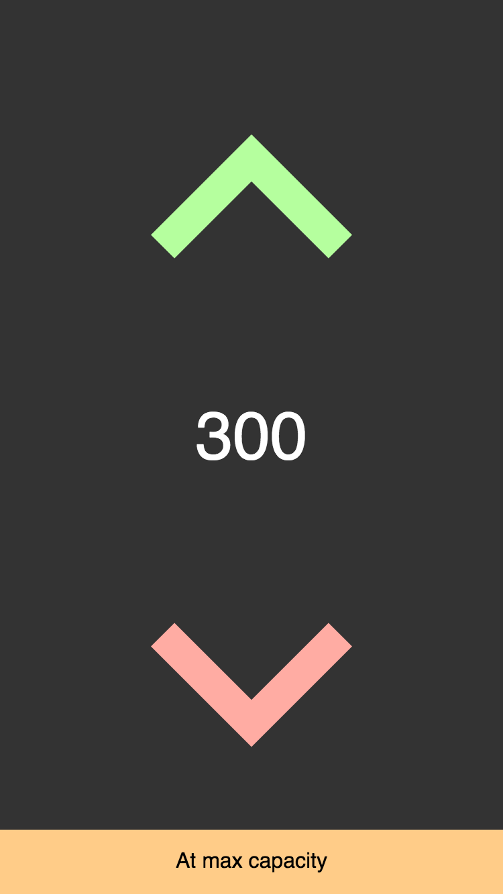
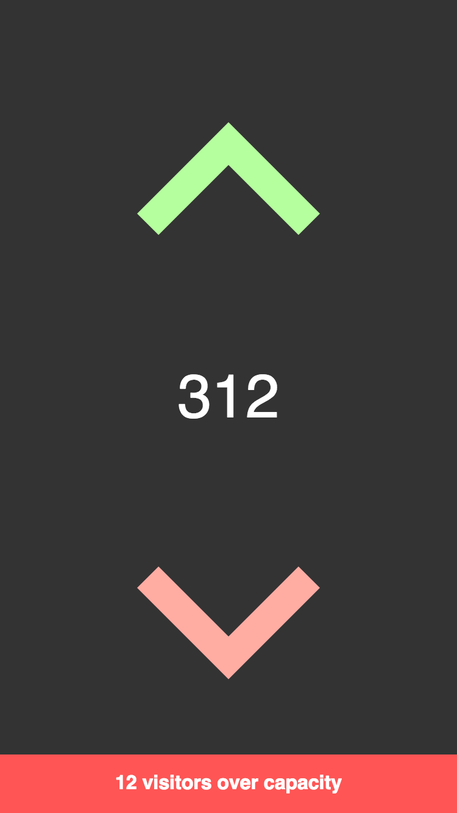
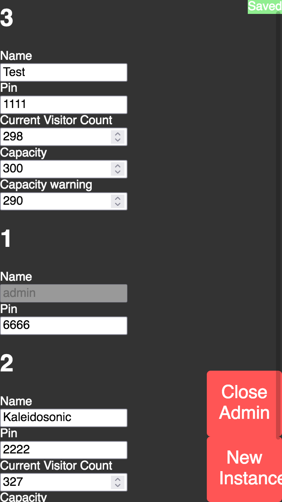

# DoorTally
A simple webapp that allows ushers at events to count the number of audience members with their phones.

Keeps a log with timestamps for data collection purposes

Built with Flask and socket.io

